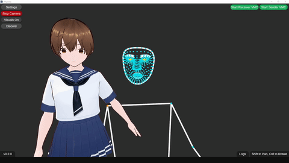

# VRigUnity
A virtual character AI animator.
This app takes a `VRM` model and uses your webcam to move the virtual character.

## Info
This app has been tested on:
+ *Windows 10*
+ *Ubuntu 18.04*
+ *Mac 11.x & 12.x*

Features:
* Panning and rotation controls (Shift *Pan*) (Ctrl *Rotate*)
* Allows custom background images
* Allows custom VRM models
* VMC sender
* Virtual camera support *(Only Windows)*

## Translations
It is allowed to make PR's for language translations of this app.

Here is a small guide on how to add translations: [Translation Guide](./Assets/StreamingAssets/lang/README.md)

## Translation Credits

## Dependencies
+ [MediaPipeUnityPlugin v0.10.1](https://github.com/homuler/MediaPipeUnityPlugin)
+ [UniVRM v0.107.0](https://github.com/vrm-c/UniVRM)
+ [StandaloneFileBrowser v1.2](https://github.com/gkngkc/UnityStandaloneFileBrowser)
+ [SimpleFileBrowser v1.5.7](https://github.com/yasirkula/UnitySimpleFileBrowser)
+ [UnityCapture (fe461e8f6e1cd1e6a0dfa9891147c8e393a20a2c)](https://github.com/schellingb/UnityCapture)
+ [EasyVirtualMotionCaptureForUnity v3_9c](https://github.com/gpsnmeajp/EasyVirtualMotionCaptureForUnity)

## Building
See [BUILD.md](./BUILD.md)
